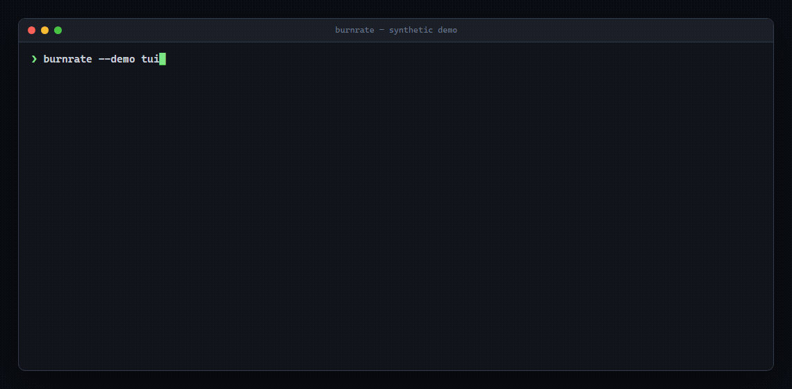

# burnrate

**`htop` for coding-agent spend.** See what Claude Code and Codex cost, which
sessions burn the most tokens, and where agents keep reading the same files.



Local-only: burnrate reads the logs already on your machine. Nothing is uploaded.

If burnrate helps you catch an expensive agent loop, please **star the repo** so
other builders can find it.

## Install

```sh
cargo install --git https://github.com/zenovis2-create/burnrate
```

Prebuilt macOS, Linux, and Windows binaries are available on the
[latest release](https://github.com/zenovis2-create/burnrate/releases/latest).

## Use

```sh
burnrate report     # sessions ranked by estimated cost
burnrate tui        # interactive terminal dashboard
burnrate --days 30  # widen the window
burnrate --demo tui # try it with synthetic, privacy-safe data
```

burnrate automatically reads:

- Claude Code: `~/.claude/projects/**/*.jsonl`
- Codex: `~/.codex/sessions/**/*.jsonl`

## What it shows

- estimated API-rate cost by session and harness
- input, cached-input, and output token totals
- cache share (reported separately from waste)
- redundant Claude Code `Read` tool calls and the worst repeated file
- the most expensive sessions first

## Support

| Harness | Spend | Cache | Repeated file reads |
| --- | --- | --- | --- |
| Claude Code | yes | yes | yes |
| Codex | yes | yes | not yet |
| Cursor | planned | planned | planned |
| Gemini CLI | planned | planned | planned |

## Accuracy and privacy

Costs are estimates from a small hardcoded price table, not invoice data. Log
formats and provider prices change; verify important numbers against your bill.
Codex rollout files may repeat cumulative totals across forked threads.

Parsing happens locally and burnrate has no telemetry or network client.

## What this is not

- not a memory server
- not an agent development environment
- not an MCP kitchen sink
- not a cloud billing service

## Roadmap

- Cursor and Gemini CLI parsers
- editable price table
- JSON output
- package-manager installs

MIT licensed.
